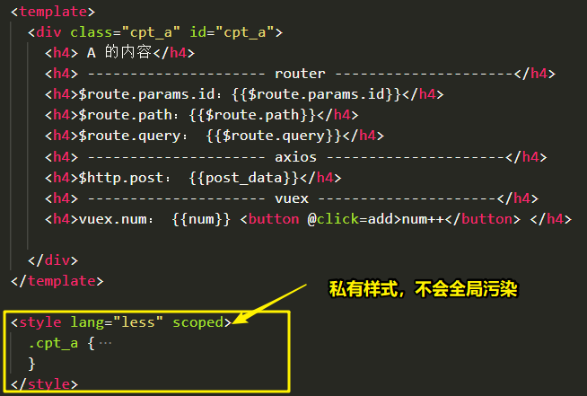
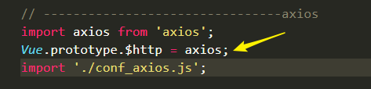

# cli-wpkEpr-spa


## 前言

- 构建：
  - `webapck@2.2.1`
  - `webpack-dev-server@2.3.0`
  - `express@4.16.4`  `mongoose@5.3.13`
- **场景：**
  - 前端：vue`SPA`单页面应用；
  - 后台：
    - 联调公司后台；
    - `express`全栈开发；
- 特点：
  - 前端：
    - **vue组件内只能写ES5语法；**
    - 需配置源文件夹和目标文件夹地址；
    - 前端页面修改后，自动刷新；
    - 支持与公司后台联调；
  - 后端：支持全栈开发时，后台服务修改后，自动重启；


## 问题

* vue文件内不能编译ES6语法；
* 异步引入路由组件，打包测试：异步加载后，路由切换回来不再显示；
* 异步引入第三方，打包测试：异步加载后，路由切换回来不再显示；
* 异步引入输出文件名是单独配置，由于引入的方式不能设置打包后的名字，但是第三方是经过编译和压缩的，可能在项目的压缩阶段出现问题；


## cli

```json
  "scripts": {
    // 前端开发，api可以和后台联调
    "web_dev": "set NODE_ENV=development&& webpack-dev-server --open --inline",
      
    // 前端打包
    "web_build": "set NODE_ENV=production&& webpack --progress --hide-modules",
      
    // 与前端形成简单联调测试，真实联调不开启
    "api_proxy": "set NODE_ENV=api_simple&& node ./api_server/app_auto.js",
      
    // 后台开发 热启动
    "api_only": "set NODE_ENV=api_only&& node ./api_server/app_auto.js",
     
    // 前后端全部完成
    "all": "node ./api_server/app.js"
  },
```


## 前端 SPA

### 目录结构


- 入口js：
  - 入口HTML和入口JS文件都是靠webpack插件结合在一起；
  - 其他子组件和vue相关配置文件都是引入到 主index.js文件内；


### 入口HTML和JS

- HTML

```html
<body>
  <div id="app"></div>
</body>
```

- JS:

```js
import Vue from 'vue';

// --------------------------------router
import VueRouter from 'vue-router';
Vue.use(VueRouter);
// 配置路由
import routes from './conf_router.js';
var router = new VueRouter({
  routes: routes,
});
// --------------------------------axios
import axios from 'axios';
Vue.prototype.$http = axios;
import './conf_axios.js'; // 只是引入，没有导出，那就引入就可以了。


// ---------------------------------vuex
import conf_vuex from './conf_vuex.js';


import App from './App.vue';
new Vue({
  el: '#app',
  render: h => h(App),
  // 开启路由
  router: router,
  // vuex
  store: conf_vuex,
});
```


### App.vue

- 作用：
  - 从后台请求路由数据（name-->path数据），渲染在组件内；
  - 且提供`<router-view></router-view>`路由视图组件；


### conf_router.js

- 路由配置核心文件，配置（path---->component）


* 路由组件A：视图与样式



- 路由组件A：使用vuex的属性和方法：


### conf_axios.js

- axios在index.js内部的配置：



- `conf_axios.js`配置拦截器：**因为是每个文件都是个模块，内部需要`axios`，需要再次引入**


### conf_vuex.js

- 内部使用`vue vuex`，内部引入：


## 前端：webpack.config.js 配置

```js
// 基本配置
var conf = {
  // 前端测试模式下的端口
  dev_port: 1010,

  // 本地后台1011 打包后/测试时 被代理的端口
  api_port: 1011,
};

// dev需求：
var one = {

  // ****约定：该模块下，dev引用和build的输出 目录名称：
  imgs_dir: 'imgs',
  fonts_dir: 'fonts',
  // 异步文件的标识 async
};

// 配置项
var opts = {
  // dev模式下，源文件夹名称；
  src: "src_webapp",

  // 依赖文件的目录名称，需要复制
  copy: "scripts",

  // 打包的目录名称
  dist: 'webapp',
};
```


## 前端：npm run web_dev

- 内部执行核心：前端dev模式，代理开启；
- 适用场景：
  - **页面功能HTML+CSS+JS 页面功能开发**
  - 与后台联调

```js
  devServer: {
    // dev 端口
    port: conf.dev_port,
    contentBase: path.resolve(__dirname, opts.src),
    historyApiFallback: true, // 静态资源目录
    hot: false,
    inline: true, // cli 模式，内联模式
    noInfo: true,
    // 代码端口
    proxy: {
      "/api": 'http://localhost:' + conf.api_port,
    }
  },
```


## 前端：npm run web_build

- 内部执行核心：
  - 执行webpack.config.js 的build配置；
  - 把源文件输出到目标目录下；
  - JS：
    - 混淆
    - 无sourceMap
    - 文件有hash值；
  - CSS：
    - 第三方css文件分离打包；
    - vue组件内的CSS打包在JS内；
  - 图片:
    - 小于限制在JS内（base64）
    - 大于限制输出在目标目录下的指定文件夹下；
  - HTML：
    - 打包后的js被引入index.html


### vender.js

* 场景1：很多地方使用的第三方，可以使用npm安装；

* 入口：


* 公共文件分离配置：


* js文件名hash值配置：


- 上下配置重复，有一个配置即可：不然会有报错


* 场景2：其他第三方JS和CSS，在页面中多次使用且不能通过npm安装，直接在HTML中引入；


### Element-ui 按需加载

* 按需引入：

```js
import {
  DatePicker,
  ColorPicker,
  Progress
} from 'element-ui';
Vue.use(DatePicker);
Vue.use(ColorPicker);
Vue.use(Progress);
```

* 安装

```
npm install babel-plugin-component -D
```

* 需要配置，不然只有JS会被打包出来，CSS文件不会打包出来；


- 配置CSS剥离：


* 打包效果：CSS分离，依赖JS打包到vender.js


### 问题：vue文件 ES6不编译!!!

* vue-loader：**不能编译组件内ES6的语法，只能编译ES5语法；**

- 因为不能编译ES6，混淆时会有错；


### 问题：异步引入路由及第三方加载后不再显示 

* 异步引入路由组件可打包，但是异步加载只是一次；路由切换回来不再显示；
* 异步引入第三方JS和CSS，可打包；但是同样只是加载一次，路由切换回来不再显示；
* 解决：
  * 同步引入路由组件，内部**异步引入 其他vue组件；**
  * **异步引入 vue组件，**内部同步引入第三方JS和CSS；（问题：由于异步引入 vue组件方式不能命名打包后的名称，所以第三方JS和CSS也会面临编译和压缩，可能会有问题）


### 异步引入 vue组件

* 异步引入的语法：ES5


### 其他

* `vue-template-compiler`的版本要与`vue`的版本一致；
* `webpack2.4.*`集成`vue-loader@15.2.4`报错：原因：Vue-loader在15.*之后的版本都是 vue-loader的使用都是需要伴生 VueLoaderPlugin的,


## 后台：目录结构

- `api_server`  【后台的根目录】
  - `collection` 【前端的业务模块对应后台的数据库模型】
    - `xx_model.js` 【具体的数据库模型】
  - `moudles` 【前端的业务模块对应后台的设计的API文件】
    - `xx_api.js` 【每个模块对应设计的api文件】
  - `app_auto.js` 【测试模式入口文件，根据模式进入测试不同的文件】
  - `app_simple.js` 【前端联调时，简单地充当后台的服务】
  - `app.js`【后台开发时或者完成后，入口文件】
  - `conf.js`【后台的配置文件】


## 后台：`app_auto.js`

```js
var nodemon = require('gulp-nodemon');
var path = require('path');

var src;
var env = process.env.NODE_ENV;
switch (env) {
  // 简单的与前端联调
  case "api_simple":
    console.log("与前端简单联调测试 热开启");
    src = path.join(__dirname, './app_simple.js');
    break;

    // 后台开发模式
  case "api_only":
    console.log("后台开发 热启动");
    src = path.join(__dirname, './app.js');
    break;
};

nodemon({
  script: src,
  ignore: [
    path.join(__dirname, '../src_webapp/'),
    path.join(__dirname, '../webapp/'),
    path.join(__dirname, '../gulpfile.js'),
    path.join(__dirname, '../cmd.js'),
  ],
  env: { 'NODE_ENV': 'development' }
});
```


## 后台：npm run api_proxy

- 前端开发完成后，需要与后台进行简单的联调；
- 若后台此时不能配合，该功能可简单的进行联调；


## 后台：npm run api_only

- 执行核心：后台热启动开发，该模式完全是后台开发；


## 后台：npm run all

- 执行核心：前端开发完成，后台开发完成，在服务器上部署启动服务时；


